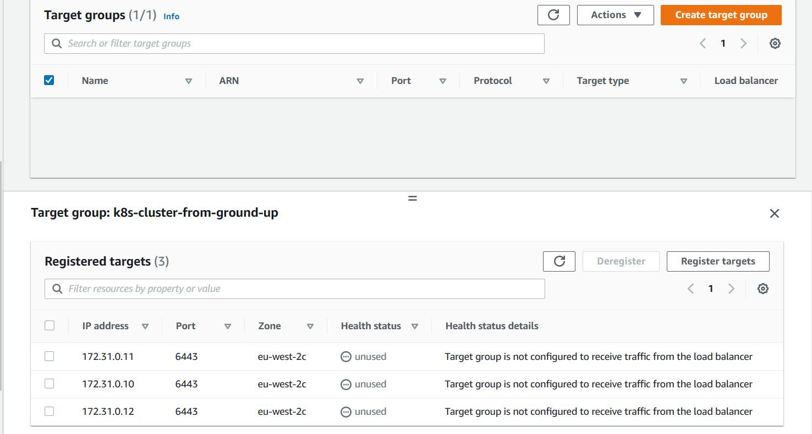

# KUBERNETES CLUSTER FROM GROUND UP

You will create 6 EC2 Instances, and in the end, we will have the following parts of the cluster properly configured:

- 3 Kubernetes Master
- 3 Kubernetes Worker Nodes
- Configured SSL/TLS certificates for Kubernetes components to communicate securely
- Configured Node Network
- Configured Pod Network

#
Adding AWS Credentials to the clients terminal

Kubectl installed and present on client server

cfssl installed and present on client server

#
## Infrastructure Setup For Cluster Configuration
#
As we already know, we need some machines to run the control plane and the worker nodes. In this section, we will provision EC2 Instances required to run the K8s cluster. In this project, I made use of terraform to spin up the infrastructure for setting this up.

The following resources were setup:

- VPC
- DHCP
- Internet Gateway
- Route Tables
- Security Groups for Cluster
- Network Load Balancer and Listener
- Target Groups
- 6 EC2 Instances 3 Master 3 Worker

#
## Creating Network Resources
#

#
## Creating Compute Resources
#

## PREPARE THE SELF-SIGNED CERTIFICATE AUTHORITY AND GENERATE TLS CERTIFICATES
### The following components running on the Master node will require TLS certificates.
- kube-controller-manager
- kube-scheduler
- etcd
- kube-apiserver
  
### The following components running on the Worker nodes will require TLS certificates.
- kubelet
- kube-proxy

We will provision a **PKI** Infrastructure using cfssl which will have a Certificate Authority. The CA will then generate certificates for all the individual components.

### Self-Signed Root Certificate Authority (CA)
- We provision a CA that will be used to sign additional TLS certificates.

### Generating TLS Certificates For Client and Server

Using the CA, we provision TLS certs for the following
- kube-controller-manager
- kube-scheduler
- etcd
- kubelet
- kube-proxy
- Kubernetes Admin User
  

## Distributing the Client and Server Certificates
#
After creating all certifiates, now it is time to start sending all the client and server certificates to their respective instances.

## Sending to Worker Instance Servers

## Sending to Master Instance Servers

## `KUBECTL` TO GENERATE KUBERNETES CONFIGURATION FILES FOR AUTHENTICATION

In this step, you will create some files known as kubeconfig, which enables Kubernetes clients to locate and authenticate to the Kubernetes API Servers. Then we transfer it to their respective nodes.

## Sending Kubeconfig to Master node

## Sending Kubeconfig to Worker node

#
## PREPARE THE ETCD DATABASE FOR ENCRYPTION AT REST.
#

#
## BOOTSTRAP THE CONTROL PLANE
In this section, we will configure the components for the control plane on the master/controller nodes.

## Controlplane

## Containerd 

## Kubelet

## Successful configuration from successful worker node query via the API-server from the client
